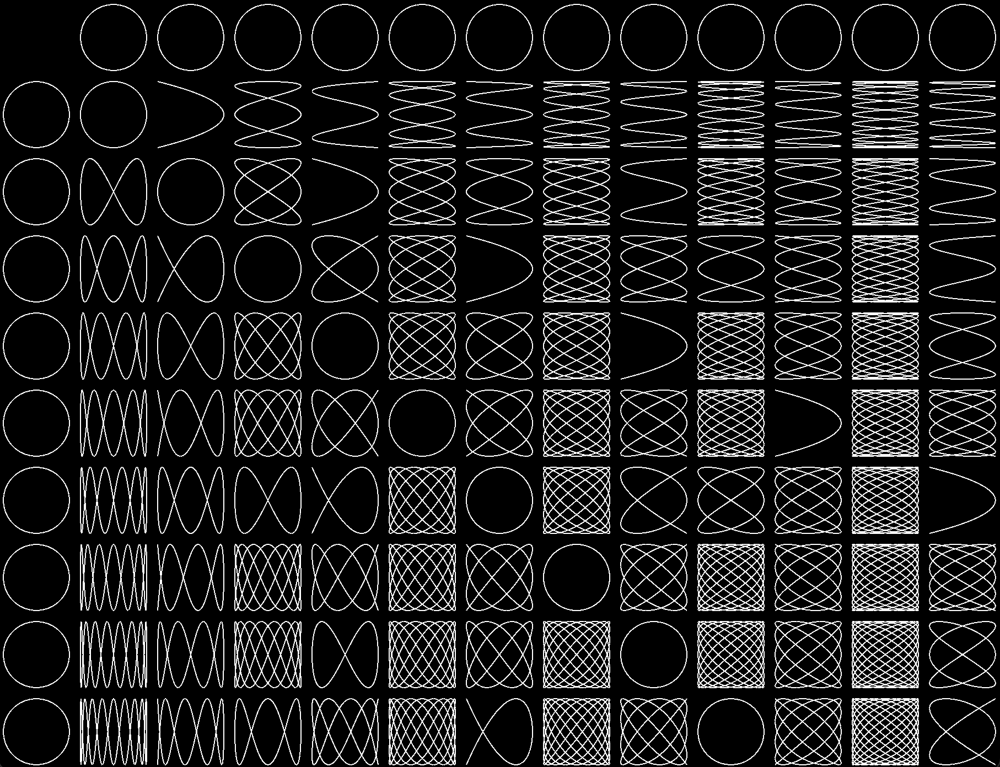

<pre align="center">

<strong>Charles C. Morace</strong> 

> I'm a software engineer and computer science teacher living in Taiwan. 
> I am interested in the intersection of art, mathematics, computer science, and
> education. Currently, I teach programming at a private school in Tainan.
> I graduated from National Cheng Kung University with a master's in computer 
> science in 2020. My research is related to machine learning and computer graphics.

